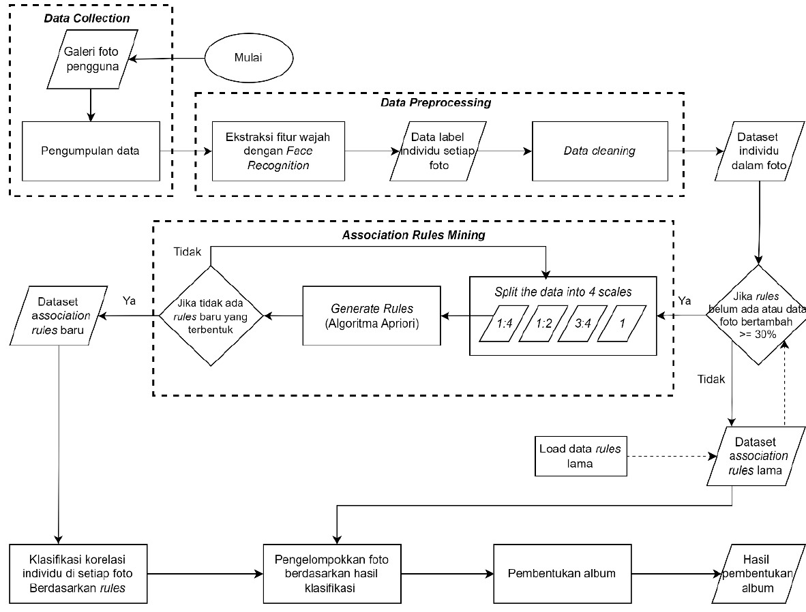

# Implementation of Association Rule Mining with the Apriori Algorithm for Automating Digital Photo Collection Management

## Overview

This repository contains a comprehensive system for face detection, recognition, and dataset management. It includes code for face processing, dataset consistency checking, rule mining, and more. The system is designed to handle and analyze face images, detect faces, recognize known individuals, and organize the dataset into structured formats. This README provides an overview of the project, setup instructions, and key details about the functionalities and results.

## Requirements

To run this project, you'll need the following libraries and tools:

- **Python 3.11**: Ensure you have Python installed.
- **Libraries**:
  - `mlxtend` for pattern mining and association rule learning
  - `opencv-python` (cv2) for image processing
  - `dlib` for facial landmark detection
  - `face_recognition` for face recognition
  - `mtcnn` for face detection
  - `numpy` and `pandas` for data manipulation
  - `scikit-learn` for machine learning model evaluation
  - `matplotlib` for data visualization
  - `Pillow` (PIL) for image processing
  - `glob`, `os`, `shutil` for file management
  - `re` for regular expressions
  - `itertools` for combinations
  - `ast` for safe evaluation of Python literals

You can install the required libraries using `pip`:

```bash
pip install mlxtend opencv-python dlib face_recognition mtcnn numpy pandas scikit-learn matplotlib pillow
```

## Cloning the Repository

To get started with the project, first, clone the repository to your local machine:

```bash
git clone https://github.com/yourusername/yourrepository.git
```

Replace `https://github.com/yourusername/yourrepository.git` with the actual URL of your repository.

## Setting Up the Environment

1. **Navigate to the Project Directory**:

   Change into the project directory you just cloned:

   ```bash
   cd yourrepository
   ```

2. **Create a Virtual Environment**:

   It’s a good practice to use a virtual environment to manage dependencies. You can create a virtual environment using `venv`:

   ```bash
   python -m venv env
   ```

3. **Activate the Virtual Environment**:

   - **On Windows**:

     ```bash
     .\env\Scripts\activate
     ```

   - **On macOS and Linux**:

     ```bash
     source env/bin/activate
     ```

4. **Install the Required Libraries**:

   With the virtual environment activated, install the required libraries using `pip`:

   ```bash
   pip install mlxtend opencv-python dlib face_recognition mtcnn numpy pandas scikit-learn matplotlib pillow
   ```

5. **Install Jupyter Notebook**:

   To run Jupyter Notebook, you need to install it as well:

   ```bash
   pip install notebook
   ```

## Running Jupyter Notebook

1. **Start Jupyter Notebook**:

   From the command line with the virtual environment activated, start Jupyter Notebook:

   ```bash
   jupyter notebook
   ```

   This command will open Jupyter Notebook in your default web browser.

2. **Open the Notebook**:

   - Once Jupyter Notebook is running, it will display a file browser in your web browser.
   - Navigate to the directory where the notebook files (`.ipynb`) are located. This will typically be within the cloned repository's folder.
   - Click on the desired notebook file to open it and begin working with it.

## Example Directory Structure

Assuming you have cloned the repository into a folder named `yourrepository`, the typical directory structure might look like this:

```
yourrepository/
│
├── images/
│   └── ... (your images)
├── notebooks/
│   └── your_notebook.ipynb
├── src/
│   └── ... (your code files)
├── requirements.txt
└── README.md
```

Ensure you navigate to the appropriate folder where your `.ipynb` files are located to open and work with them in Jupyter Notebook.

---

Feel free to adjust the paths and repository details according to your specific setup.

## Getting Started

1. **Set User Parameters**: Define the user identifier (`pengguna_user`) to specify which dataset and directories to use.

2. **Define Directories and Paths**: Set the following parameters:
   - `image_dir`: Directory for input images.
   - `output_base_dir`: Directory for saving processed images.
   - `existing_dataset_path`: Path to the CSV file that tracks face data.

3. **Run Image Processing**: Call the function `process_images(image_dir, output_base_dir, existing_dataset_path)` to detect and recognize faces, save them in organized folders, and update the dataset CSV.

4. **Clean the Dataset**: Filter and clean the processed DataFrame (`df_process`) and save it back to the CSV file.

5. **Consistency Check**: Ensure that image filenames match their corresponding folders and update the DataFrame accordingly.

6. **Update Rules**: Use `check_and_update_rules()` to update the rules based on dataset changes and save them.

7. **Apply Rules**: Normalize and group rules, then apply them to classify photos into albums.

8. **Organize Photos**: Use `create_album` to organize photos into directories and `process_photos` for images not included in any album.

## Design Diagram



## Experiment Results

### Face Recognition

- **Total Faces Tested**: 101
- **Recognized Faces**: 89
- **Unrecognized Faces**: 12
- **Accuracy**: 88.12%

Factors such as lighting, photo quality, and face pose affect recognition accuracy.

### Sensitivity Analysis

- **Optimal Parameters for User 1**:
  - Minimum Support: 3%
  - Minimum Confidence: 70%

### User Scenario Users 1

- **Total Photos Processed**: 672
- **Album Creation Time**: ~25 minutes
- **Albums Created**:
  - "College"
  - "Family"
  - "With Ulfa"

The system classified 567 out of 641 photos correctly, with some limitations noted in recognition accuracy and album classification.

## Further Analysis

The face recognition system achieved a good accuracy of 88.12%, but factors like lighting and pose variability need improvement. The association rule mining showed optimal parameters for album creation, and the system's performance in classifying photos into albums was generally effective.

## Contributing

Feel free to contribute to this project by opening issues or submitting pull requests. For detailed contributions, please refer to the [CONTRIBUTING.md](CONTRIBUTING.md) file.

---

This README provides an overview of the project's functionalities and how to get started. For detailed explanations and code, please refer to the notebook and code files included in this repository.
